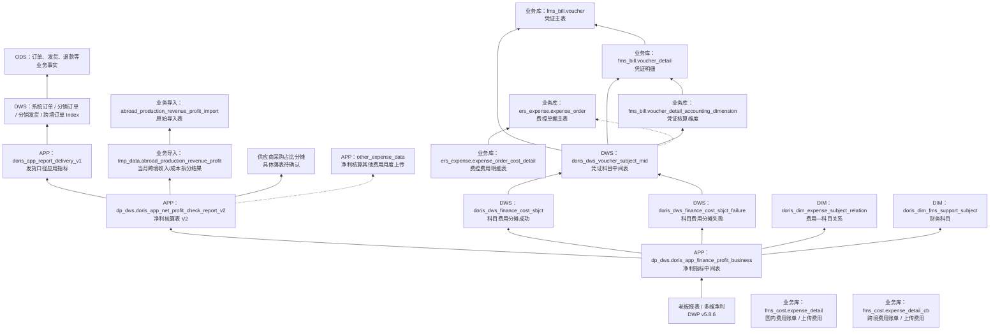

# T+1 净利血缘穿透图

> 范围为已确认链路。虚线表示当前仅确认业务来源或上游层级，尚未取得具体 ODS/DWD 物理表映射。

## 层级说明

- `doris_app_finance_profit_business` 是老板报表的净利汇总入口；其唯一键包含日期、经营主体、商品、科目和国别等维度。
- `doris_app_net_profit_check_report_v2` 承接发货 V1、跨境业务导入、供应商采购占比分摊和业务上传费用。
- 财务费用链路由凭证科目中间表、分摊成功/失败表和费用—科目关系共同补充至净利中间表。凭证事实已确认通过 `voucher_id` 和 `voucher_detail_id` 两级关联，且限定账套 `4`；收入类金额为正，成本/费用类金额为负。费用账单与业务上传是独立费用事实链路，不混入本 Sheet 的凭证中间表构建规则。
- 发货 V1 已确认直接从 DWS Index 取数；DWS 的下游为订单/发货/退款 ODS。各 Index 到 ODS 的详细表级血缘见销售、售后与跨境资产文档。

## 待补的物理穿透

1. 供应商采购占比分摊的输入、计算结果表及其与 V2 的关联键。
