# 发货 V1 血缘图

`dp_dws.doris_app_report_delivery_v1` 是按 `dt + 应用维度组合` 聚合的应用层表；下图中的实线表示已确认的 DWS 输入，虚线表示 V1 文档已引用、但物理表或接入规则仍待补齐的来源。

```mermaid
flowchart TB
  subgraph DOM[国内正向订单]
    O1["原始订单 / 系统订单"] --> T["doris_dws_trade_order_goods_index\n系统订单商品 Index"]
    O2["分销订单 / 分销发货单"] --> D["doris_dws_dms_delivery_index\n分销发货 Index"]
  end

  subgraph DOM_R[国内售后与退货入库]
    R1["原始退款 / 系统退款"] --> SR["doris_dws_refund_order_index\n系统退单 Index"]
    R2["分销退单 / 分销退货入库"] --> DR["doris_dws_dms_refund_return_index\n分销退货 Index"]
    R3["IOM / MES 出入库事实"] --> IO["doris_dws_inbound_and_outbound_index\n出入库 Index"]
  end

  subgraph CBS[跨境]
    C1["跨境订单主子单"] --> CT["doris_dws_cbs_trade_order_index\n跨境系统订单 Index"]
    C2["跨境退款主子单"] --> CR["doris_dws_cbs_refund_order_index\n跨境系统退款 Index"]
    EZ["doris_ods_eb_trade_order_tmp\n跨境差异表（易仓历史汇总）"] --> EZ_D["doris_dws_eb_trade_order_goods_index\n易仓订单商品 Index"]
    EZ_D --> APP
  end

  subgraph SUP[补充来源]
    PLAT["dp_dim.doris_dim_platform\n平台与跨境标识维表"] --> APP
    SITE["dp_dim.doris_dim_oms_product_cbs_area_site\n跨境区域站点维表"] -. "当前 V1 未输出站点" .-> CT
    FX["fms_support.exchange_rate_system\n汇率体系表"] --> CT
    FX --> CR
    FEE["fms_cost.expense_detail_cb\n跨境费用明细字段待确认"] -.-> APP
    FIN["dp_dws.doris_dws_finance_cost_sbjct\n财务科目费用分摊事实"] --> APP
  end

  T --> APP["dp_dws.doris_app_report_delivery_v1\n发货 V1 应用指标表"]
  D --> APP
  SR --> APP
  DR --> APP
  IO --> APP
  CT --> APP
  CR --> APP
```

## 各输入承担的指标

| 输入 | 对 V1 的主要贡献 | 时间口径 |
|---|---|---|
| 系统订单商品 Index | 国内发货数量、收入、供货/采购/净利/返利成本及税额 | 发货时间 |
| 分销发货 Index | 分销发货数量、收入、供货/采购/净利/返利成本及税额 | 发货时间 |
| 系统退单 Index | 系统已发货、未发货退款及对应成本/税额 | 商家退款时间 |
| 分销退货 Index | 分销退款、退货及对应成本/税额 | 退款申请时间 |
| 出入库 Index | 退货应收入库、无单退货、退货实收和分销退货入库数量 | 完成/入库时间 |
| 跨境系统订单 Index | 跨境发货数量、人民币收入及供货/采购/净利成本 | 实际发货时间 |
| 跨境系统退款 Index | 跨境已/未发货退款、退货数量及相关成本 | 退款申请/完成时间 |
| 平台维表 | 平台属性、`cbs_platform` 及国别判定 | `dt + shop_plat_code → dt + plat_code` |
| 跨境区域站点维表 | 跨境订单站点名称、区域与国家属性 | `dt + site_code` |
| 汇率体系表 | 外币订单收入、退款支出折算人民币 | 按业务时间匹配生效区间的 `direct_exchange_rate`；CNY=1，无生效汇率取最新日期 |
| 财务科目费用分摊事实 | 天猫超市收入、不含税收入与销项税额 | `dt`，`shop_plat_code='TMCS'`，`cost_code IN ('CI168','CI654')` |
| 销售模块商品级直接字段 | 含/不含税订单收入、销项/成本进项税额、卖家运费及代发费相关税额 | 直接汇总，不经费用采集策略表 |

## 跨境历史切换

- 发货数量、发货收入：V1 文档写明“7 月 15 日前易仓，8—9 月跨境差异表，10 月 1 日起自研跨境”。
- 退货数量：文档写明“2025-07-15 前易仓，之后自研跨境”。
- 跨境差异表/易仓历史链路已确认：`doris_ods_eb_trade_order_tmp → doris_dws_eb_trade_order_goods_index → 发货 V1`。V1 不直接读取 ODS；易仓 DWS 已停止更新，仅保留历史冻结数据。
