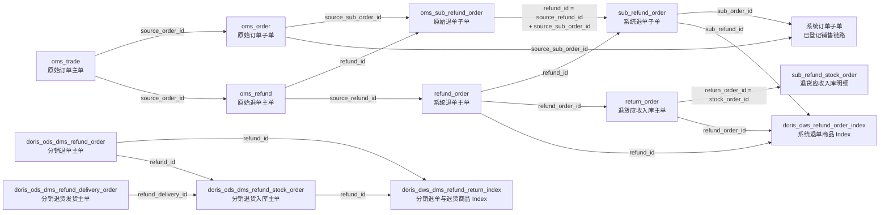

# 售后模块数据血缘 — 已确认单据链路

## 已确认关系

| 起点 | 关联键 | 终点 | 结论 |
|---|---|---|---|
| 原始订单主单 `oms_trade` | `source_order_id` | 原始订单子单 `oms_order` | 一对多订单商品行 |
| 原始退单主单 `oms_refund` | `refund_id` | 原始退单子单 `oms_sub_refund_order` | 一对多退单商品行 |
| 原始订单子单 `oms_order` | `source_sub_order_id` | 原始退单子单 `oms_sub_refund_order` | 原始退单精确回溯至原始订单商品行 |
| 原始订单主单 `oms_trade` | `source_order_id` | 原始退单主单 `oms_refund` | 主单级订单/退款关联 |
| 原始退单主单 `oms_refund` | `refund_id = source_refund_id` | 系统退单主单 `refund_order` | 原始退单映射系统退单 |
| 系统退单主单 `refund_order` | `refund_id` | 系统退单子单 `sub_refund_order` | 一对多系统退单商品行 |
| 系统退单子单 `sub_refund_order` | `sub_order_id` | 系统订单子单 `sub_trade_order` | 取系统订单数量、费用及成本的主关联 |
| 原始退单子单 `oms_sub_refund_order` | `refund_id = source_refund_id` 且 `source_sub_order_id` 相同 | 系统退单子单 `sub_refund_order` | 原始与系统退单的商品级交叉校验关系 |
| 系统退单主单 `refund_order` | `refund_id = refund_order_id` | 退货应收入库主单 `return_order` | 判断商家收货状态、到货与完成时间 |
| 退货应收入库主单 `return_order` | `return_order_id = stock_order_id` | 退货应收入库明细 `sub_refund_stock_order` | 取得商品级申请、实收、收货数量 |
| DMS 分销退单主单 `dms_refund_order` | `refund_id` | DMS 分销退货入库主单 `dms_refund_stock_order` | 退单至退货入库关联 |
| DMS 分销退货发货主单 `dms_refund_delivery_order` | `refund_delivery_id` | DMS 分销退货入库主单 `dms_refund_stock_order` | 退货发货至入库关联 |
| DMS 分销退单/入库主单 | `refund_id` | DMS 分销退单与退货 Index | 结果 Index 的主单关联线索；商品级转换逻辑不在本期核查范围 |

`oms_order.oms_order` 名称虽为 order，实际粒度是原始订单子单，主键为 `source_sub_order_id`。

系统退单与系统订单通过原始订单子单稳定关联；当前不启用补偿匹配或多订单拆分逻辑。
