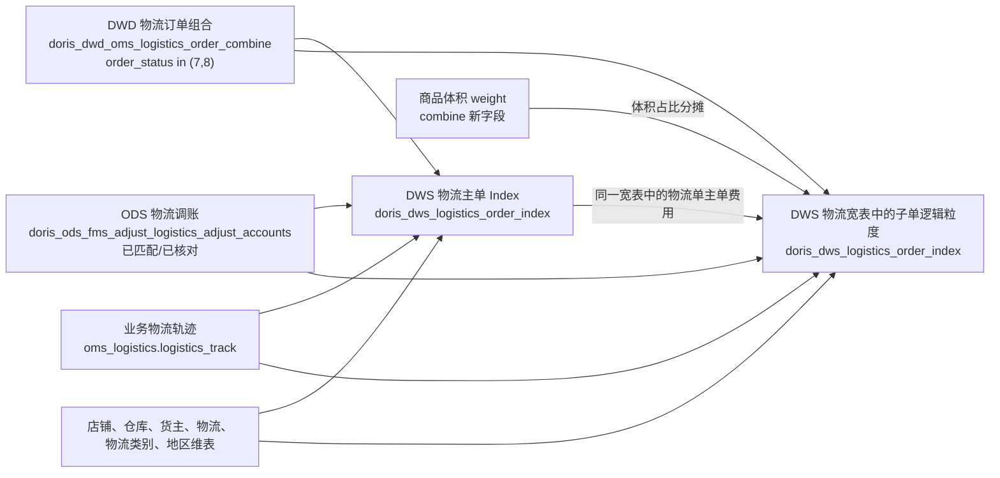

# 物流模块穿透表

## 过滤边界

- combine：仅出库单状态“已发货、已完成”。
- 调账：仅匹配状态“已匹配”、核对状态“已核对”。
- 商品 SKU 种类超过 20 的物流单：过滤。
- 箱规直接取物流明细 `carton_code`，不匹配白名单维表。
- 物流轨迹直接按 `express_code` 关联；业务确认运单号全局唯一。
- 物流宽表：每日覆盖更新最近 61 天。
- 物流宽表物理模型：`UNIQUE KEY(dt, express_code)`，`dt` 月分区。
