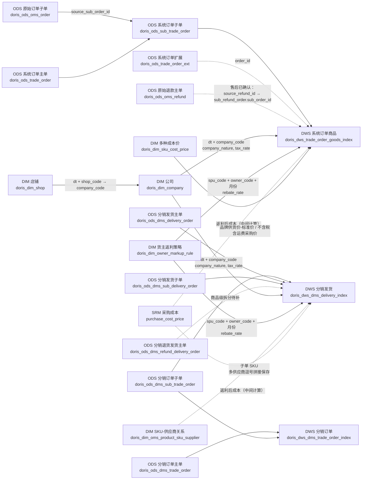

# 销售模块穿透表（V6.5.1）

## DMS Index 物理模型

| 表 | Key 模型 | 唯一键 | 更新方式 |
|---|---|---|---|
| `doris_dws_dms_trade_order_index` | `UNIQUE KEY` | `dt + sub_order_id + order_id` | 每日删除并重算最近 60 天 |
| `doris_dws_dms_delivery_index` | `UNIQUE KEY` | `dt + sub_delivery_order_id` | 每日删除并重算最近 60 天 |

## 返利字段穿透

| 输出 Index | 输出字段 | 直接规则/来源 |
|---|---|---|
| `doris_dws_trade_order_goods_index` | `rebate_rate` | 货主返利策略：`spu_code + owner_code + 业务月份` |
| `doris_dws_trade_order_goods_index` | `rebate_cost_amount` | 返利后成本中间金额 × 公司开票税率 × 返利比率；公司由店铺关联 |
| `doris_dws_trade_order_goods_index` | `input_tax_amount_rebate` | 公司一般纳税人：`rebate_cost_amount × 0.13`；小规模/个体户：0 |
| `doris_dws_dms_delivery_index` | `rebate_rate` | 货主返利策略：`spu_code + owner_code + 业务月份` |
| `doris_dws_dms_delivery_index` | `rebate_cost_amount` | 一般纳税人：不含税采购价总额 × `1.09` × `rebate_rate` ÷ `1.13`；小规模/个体户：不含税采购价总额 × `1.09` × `rebate_rate`。采购价税率固定 9%，供应商多值关系不参与税率拆分或聚合 |
| `doris_dws_dms_delivery_index` | `input_tax_amount_rebate` | 公司一般纳税人：`rebate_cost_amount × 0.13`；小规模/个体户：0 |

## 净利成本进项税额穿透

| 输出 Index | 输出字段 | 规则 |
|---|---|---|
| `doris_dws_trade_order_goods_index` | `input_tax_amount` | 小规模公司（`company_nature = 1`）：0；其他公司：`product_cost / (1 + company_tax_rate) × company_tax_rate` |
| `doris_dws_dms_delivery_index` | `input_tax_amount` | 小规模公司（`company_nature = 1`）：0；其他公司：`product_cost / (1 + company_tax_rate) × company_tax_rate` |

`company_tax_rate` 均经 `dt + shop_code → dim_shop.company_code → dim_company.tax_rate` 取得；店铺禁用或未绑定公司编码时税率为 0。`no_tax_product_cost = product_cost - input_tax_amount`。

> 返利后成本（不含税）仅是派生 `rebate_cost_amount` 的中间计算，不单独落入 Index 字段。

## 系统订单供货成本穿透

| 输出字段 | 已发货取价优先级 | 未发货取价优先级 |
|---|---|---|
| `brand_quotation`（财务口径） | 西安仓品牌供货价 → 订单仓品牌供货价 → 仓库区域不含税含运费采购价 | 文档未定义独立未发货分支 |
| `estimate_brand_quotation`（预估） | 订单仓品牌供货价；京仓委外仓改取航天自营仓品牌供货价 → 仓库区域不含税含运费采购价 | 当天各仓品牌供货价取最高单价 |

## 重要约束

1. 三张 DWS Index 表属于一个销售模块，不表示可以直接并表汇总。
2. 原始订单主单与原始子单按 `source_order_id` 关联；原始子单与系统订单子单按 `source_sub_order_id` 关联。退款商品级链路由售后模块提供并回填到本资产。
3. 分销发货/退货和系统订单子单没有关联，不可用同名 `sub_order_id` 跨表匹配。
4. 三张 DWS 表每日重算最近 60 天：先删除窗口内旧数据，再写入新的重算结果。窗口外历史数据不因日常调度被改写。
