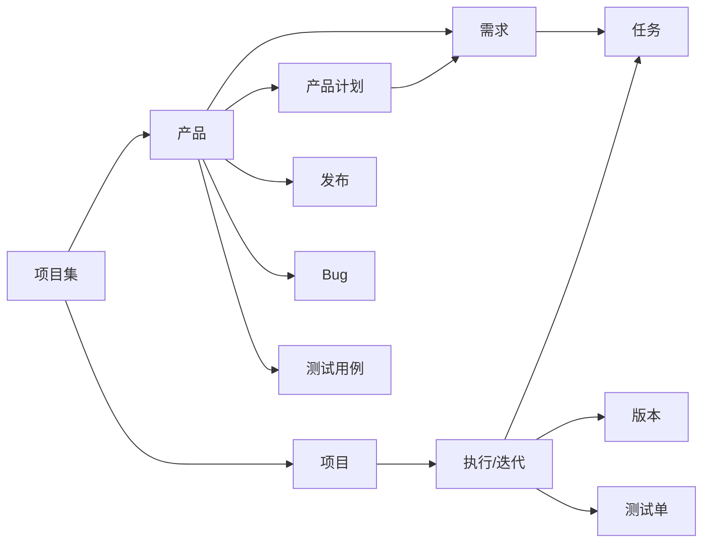

# 禅道与 zentao-cli 速览

本文档服务于 [SKILL.md](SKILL.md) 的 "第 1 步"，用于向用户快速介绍禅道与 zentao-cli，并完成工具就绪检查。

## 什么是禅道

禅道（ZenTao）是一款开源的一站式项目管理平台，覆盖研发团队的完整工作流：

- **需求管理**：记录、评审、变更业务需求与用户故事
- **项目管理**：组建项目、制定计划、排期执行
- **任务管理**：拆分任务、分派开发、跟踪进度
- **Bug 管理**：提交、指派、解决、回归 Bug
- **测试管理**：编写测试用例、执行测试单、记录缺陷
- **发布管理**：管理版本与发布，沉淀交付记录

核心对象之间的关系：



简单理解：**产品承载需求**，**项目承载执行（迭代）**，**执行承载任务**；Bug 和测试用例属于产品，测试单属于执行。

## 什么是 zentao-cli

[zentao-cli](https://github.com/easysoft/zentao-cli) 是官方命令行工具，封装了禅道 RESTful API v2.0，特点：

- 覆盖 20+ 模块（产品、项目、执行、需求、Bug、任务、测试用例、计划、版本、发布、反馈、工单等）的 CRUD 与状态流转
- 对 AI 友好：默认输出 Markdown 表格便于阅读，加 `--format=json` 可获取结构化数据
- 支持工作区上下文（记住当前产品/项目/执行），避免重复传参
- 内置过滤、排序、分页、模糊搜索、字段摘取

更多命令细节见 [zentao-cli 技能文档](../zentao-cli/SKILL.md)。

## 两种接入方式

### 方式一：本地 CLI（推荐，快速上手）

优先使用系统中已有的包管理器全局安装：

```bash
npm install -g zentao-cli
# 或 bun install -g zentao-cli
# 或 pnpm install -g zentao-cli
# 也可免安装：npx zentao-cli
```

首次使用登录禅道：

```bash
zentao login -s https://zentao.example.com -u <账号> -p <密码>
```

登录成功后凭证缓存在 `~/.config/zentao/zentao.json`，后续无需重复登录。

也可以通过环境变量配置（优先级低于命令行参数）：`ZENTAO_URL`、`ZENTAO_ACCOUNT`、`ZENTAO_PASSWORD`、`ZENTAO_TOKEN`。

### 方式二：配置为 MCP 服务

若用户使用的智能工具（如 Cursor、Claude Desktop 等）支持 MCP（Model Context Protocol），可将 zentao-cli 注册为 MCP 服务，直接在对话中调用禅道能力。通用配置思路：

```json
{
  "mcpServers": {
    "zentao": {
      "command": "npx",
      "args": ["-y", "zentao-cli", "mcp"],
      "env": {
        "ZENTAO_URL": "https://zentao.example.com",
        "ZENTAO_ACCOUNT": "<账号>",
        "ZENTAO_TOKEN": "<token>"
      }
    }
  }
}
```

具体 MCP 启动方式与参数以 [zentao-cli 仓库](https://github.com/easysoft/zentao-cli) 的最新说明为准；不同智能工具的配置文件位置不同（Cursor 的 `~/.cursor/mcp.json`、Claude Desktop 的 `claude_desktop_config.json` 等）。

## 就绪自检

正式开始前，顺手跑一下这两条，把账号和连通性确认掉：

```bash
zentao profile                               # 确认已登录，显示当前账号
zentao product --pick=id,name               # 能正常拉取产品列表
```

如果返回错误：

- `E1001` / `E1004`：未登录或 Token 失效 → 让用户执行 `zentao login ...`
- 命令找不到（`command not found`）→ 回到上文"方式一"安装
- 网络错误 / `E5001` → 检查禅道服务地址是否正确、网络是否可达

通了之后回到 SKILL.md，顺势问用户想从哪个角色切入就好。

## 外部资料

- [禅道官网](https://www.zentao.net/)
- [禅道使用手册](https://www.zentao.net/book/zentaopms/38.html)
- [禅道不同版本功能对比](https://www.zentao.net/compare-features.html)
- [zentao-cli 仓库](https://github.com/easysoft/zentao-cli)
